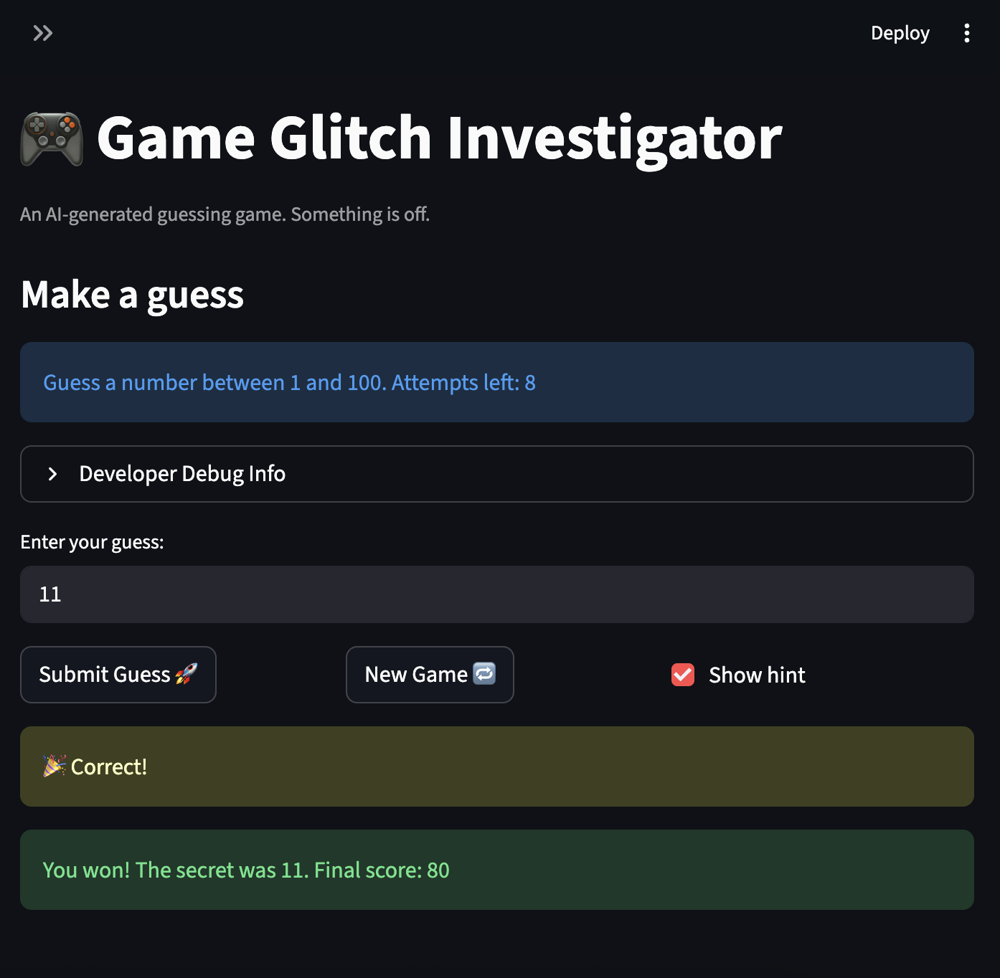

# 🎮 Game Glitch Investigator: The Impossible Guesser

## 🚨 The Situation

You asked an AI to build a simple "Number Guessing Game" using Streamlit.
It wrote the code, ran away, and now the game is unplayable. 

- You can't win.
- The hints lie to you.
- The secret number seems to have commitment issues.

## 🛠️ Setup

1. Install dependencies: `pip install -r requirements.txt`
2. Run the broken app: `python -m streamlit run app.py`

## 🕵️‍♂️ Your Mission

1. **Play the game.** Open the "Developer Debug Info" tab in the app to see the secret number. Try to win.
2. **Find the State Bug.** Why does the secret number change every time you click "Submit"? Ask ChatGPT: *"How do I keep a variable from resetting in Streamlit when I click a button?"*
3. **Fix the Logic.** The hints ("Higher/Lower") are wrong. Fix them.
4. **Refactor & Test.** - Move the logic into `logic_utils.py`.
   - Run `pytest` in your terminal.
   - Keep fixing until all tests pass!

## 📝 Document Your Experience

- Game's Purpose: The Glitchy Guesser is a number guessing game built with Streamlit. The player picks a difficulty, gets a range, and tries to guess a secret number within a limited number of attempts. The game gives hints after each guess and tracks your score.
- Bugs Found: The hints in check_guess were reversed, telling players to go higher when they should go lower. The "New Game" button didn't reset the game status, history, or score, so the game froze after one round. The scoring system was inconsistent, giving random points on "Too High" guesses depending on whether the attempt number was even or odd. There was also a string conversion bug that compared a number guess to a string secret on even attempts.
- Fixes Applied: I swapped the hint messages so "Too High" says "Go LOWER" and "Too Low" says "Go HIGHER." I fixed the new game button to reset status back to "playing," clear history, and use the correct difficulty range instead of hardcoding 1–100. I removed the inconsistent even/odd scoring so both wrong guess types lose 5 points equally. I also removed the string conversion bug that was messing up comparisons on even attempts.

## 📸 Demo

- [ ] [Insert a screenshot of your fixed, winning game here]

## 🚀 Stretch Features

- [ ] [If you choose to complete Challenge 4, insert a screenshot of your Enhanced Game UI here]
